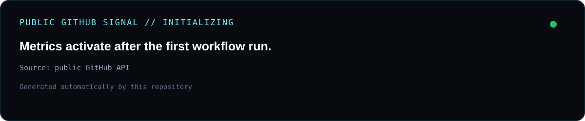

<div align="center">


# GARHY TECH

**Software Engineering · AI · Automation · Cloud · APIs · Security · DevOps**

`PERFORMANCE` · `SCALABILITY` · `MAINTAINABILITY` · `RELIABILITY`

[Launch Command Center](https://garhy-tech.github.io/Garhy-tech/) · [Website](https://garhy.tech) · [GARHY AI / HANA](https://github.com/Garhy-tech/garhy-gpt-oss-cloud) · [GitHub](https://github.com/Garhy-tech)

</div>

---

## `00 // LIVE COMMAND CENTER`

<div align="center">

### [OPEN GARHY TECH ENGINEERING COMMAND CENTER](https://garhy-tech.github.io/Garhy-tech/)

Interactive engineering surface with system status, architecture, technology stack and terminal commands.

</div>

---

## `01 // ENGINEERING SYSTEM`

```text
DISCOVER -> DIAGNOSE -> DESIGN -> BUILD -> TEST -> DEPLOY -> VERIFY -> AUTOMATE
```

| Layer | Focus |
|---|---|
| Experience | Web · Mobile · AI |
| Product Systems | AI · Platform · Commerce |
| Shared Capabilities | Auth · APIs · Data · Automation |
| Delivery | Cloud · Edge · CI/CD |
| Quality Plane | Observability · Performance · Reliability · Governance |

---

## `02 // GARHY ECOSYSTEM`

| System | Public signal | Role |
|---|---|---|
| **GARHY AI / HANA** | [Public repository](https://github.com/Garhy-tech/garhy-gpt-oss-cloud) | AI and automation |
| **Platform Systems** | Private | Shared platform capabilities |
| **Commerce Systems** | Private | Marketplace and transactions |
| **Profile Automation** | Active | Public metrics refresh |

---

## `03 // ACTIVE TECHNOLOGY SURFACE`

`TypeScript` · `JavaScript` · `React` · `Next.js` · `Node.js` · `Python` · `Supabase` · `PostgreSQL` · `AWS` · `Cloudflare` · `Vercel` · `Docker` · `GitHub Actions` · `Linux`

---

## `04 // LIVE GITHUB SIGNAL`

<div align="center">
  
</div>

<div align="center">
  
  
</div>

---

## `05 // CONTRIBUTION SNAKE`

<div align="center">
  
</div>

The contribution snake is generated from this account's actual GitHub contribution graph and refreshed automatically by GitHub Actions.

---

## `06 // CONTRIBUTION ACTIVITY`

<div align="center">
  
</div>

---

## `07 // SELECTED PUBLIC WORK`

### [GARHY AI / HANA](https://github.com/Garhy-tech/garhy-gpt-oss-cloud)
Public source repository for GARHY AI / HANA.

---

## `08 // OPERATING PRINCIPLES`

```text
01  Architecture before coupling.
02  Automate repeatable work.
03  Measure, change, verify.
04  Keep interfaces explicit.
05  Build for reliability and maintainability.
06  Scale only with observable behavior.
```

---

<div align="center">

### `GARHY TECH // BUILD • VERIFY • AUTOMATE • SCALE`

[Command Center](https://garhy-tech.github.io/Garhy-tech/) · [garhy.tech](https://garhy.tech) · [GitHub](https://github.com/Garhy-tech)

</div>
